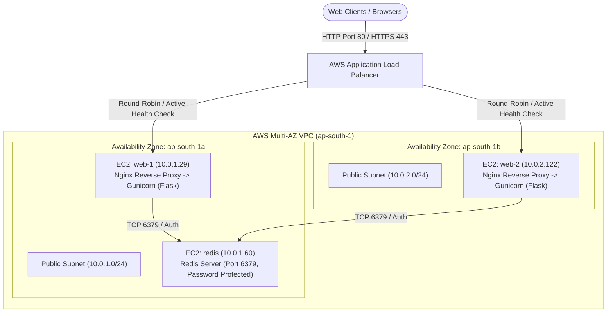

# Ansible + Terraform AWS Infrastructure Automation for Scalable Web Application


An enterprise-grade Infrastructure as Code (IaC) and Configuration Management project that provisions, configures, and manages a highly available, multi-tier, multi-AZ web application on AWS using **Terraform**, **Ansible**, **Nginx**, and **Redis**.

> 
---

## Architecture Overview



---

## Key Features

- **Multi-AZ High Availability**: Deploys web instances across distinct AWS Availability Zones (`ap-south-1a` and `ap-south-1b`) fronted by an Application Load Balancer.
- **Dynamic Inventory (`amazon.aws.aws_ec2`)**: Ansible automatically discovers instances via AWS API tags (`Role=web`, `Role=redis`), eliminating static IP management.
- **Least-Privilege Security Group Chaining**:
  - `alb-sg`: Accepts external HTTP/HTTPS traffic.
  - `web-sg`: Accepts HTTP only from `alb-sg`.
  - `redis-sg`: Accepts Redis TCP 6379 only from `web-sg`.
- **Keyless Management (IAM & SSM)**: Attached `AmazonSSMManagedInstanceCore` profile for secure AWS Systems Manager access.
- **Remote State Backend**: S3 bucket with versioning and SSE-S3 encryption + DynamoDB state locking table.
- **Shared In-Memory Caching**: Centralized Redis instance tracking distributed visitor traffic across all nodes.
- **Reverse Proxying & Hardening**: Nginx handles client requests, applies security headers, and proxies to Gunicorn WSGI.
- **Active Health Checks**: ALB continuously polls `/healthz` verifying web process and Redis database readiness.

---

## Repository Structure

```text
ansible-terraform-aws/
├── terraform/
│   ├── bootstrap/               # S3 + DynamoDB state backend setup
│   ├── modules/
│   │   ├── vpc/                 # Multi-AZ VPC, subnets, route tables, IGW, NAT GW
│   │   ├── security_groups/     # Chained least-privilege security groups
│   │   ├── iam/                 # EC2 instance profile with SSM policy
│   │   ├── alb/                 # Application Load Balancer, target group, listener
│   │   └── compute/             # EC2 instances, key pair, target group attachment
│   └── environments/
│       └── dev/                 # Dev environment orchestration & tfvars
├── ansible/
│   ├── ansible.cfg              # Ansible configuration (dynamic inventory, pipelining)
│   ├── inventory/
│   │   ├── aws_ec2.yml          # AWS EC2 dynamic inventory configuration
│   │   └── group_vars/all.yml   # Global variables and dynamic Redis host resolution
│   ├── roles/
│   │   ├── common/              # System hardening, timezone, base packages
│   │   ├── redis/               # Redis installation, redis.conf, auth, persistence
│   │   ├── app/                 # Python/Flask web app, Gunicorn, systemd service
│   │   └── nginx/               # Nginx reverse proxy, security headers, health routing
│   └── playbooks/
│       └── site.yml             # Master orchestrator playbook
├── scripts/
│   ├── run_ansible.sh           # Linux/WSL helper wrapper
│   └── run-ansible.ps1          # Windows PowerShell wrapper
└── keys/                        # Generated SSH key pair (gitignored)
```

---

## Quickstart & Deployment

### 1. Provision Infrastructure with Terraform
```powershell
cd terraform/environments/dev
terraform init
terraform plan -out=tfplan
terraform apply -auto-approve tfplan
```

### 2. Configure Servers & Deploy App with Ansible
From project root:
```powershell
# Verify dynamic host discovery
.\scripts\run-ansible.ps1 ansible-inventory -i inventory/aws_ec2.yml --graph

# Run end-to-end orchestration
.\scripts\run-ansible.ps1 ansible-playbook playbooks/site.yml
```

### 3. Verify Deployment
Query the output ALB DNS name:
```powershell
curl -I http://<ALB_DNS_NAME>/healthz
curl http://<ALB_DNS_NAME>/
```

---

## Verification & Test Results

### 1. Ansible Deployment Run (Zero Failures / Idempotent)
```text
PLAY RECAP *********************************************************************
ansible-terraform-automation-dev-redis : ok=12   changed=0    unreachable=0    failed=0    skipped=0    rescued=0    ignored=0   
ansible-terraform-automation-dev-web-1 : ok=22   changed=0    unreachable=0    failed=0    skipped=0    rescued=0    ignored=0   
ansible-terraform-automation-dev-web-2 : ok=22   changed=0    unreachable=0    failed=0    skipped=0    rescued=0    ignored=0   
localhost                              : ok=3    changed=0    unreachable=0    failed=0    skipped=0    rescued=0    ignored=0   
```

### 2. Multi-AZ Active Health Status (AWS ALB)
```json
{
    "TargetHealthDescriptions": [
        {
            "Target": { "Id": "i-01b419e345e2a601b", "Port": 80 },
            "TargetHealth": { "State": "healthy" }
        },
        {
            "Target": { "Id": "i-0ddb81419562c98a0", "Port": 80 },
            "TargetHealth": { "State": "healthy" }
        }
    ]
}
```

---

## Teardown (Clean Cloud Cleanup)
To destroy all AWS cloud resources when finished:
```powershell
cd terraform/environments/dev
terraform destroy -auto-approve
```
